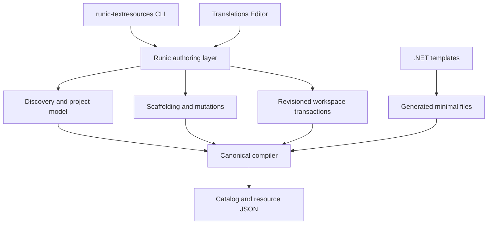

# Runic Translations Editor product plan

Status: complete
Last updated: 8 August 2026

Implementation progress: E0 through E6 are complete on the editor/tooling branch.
The customer-preview editor is implemented; stable signing/notarization remains
credential-gated as specified by E6.

## Outcome

Turn the current `RunicTextResources.Editor` vertical into the customer-facing
application for creating, editing, validating, reviewing, and maintaining Runic
Text Resources projects.

The product must be comfortable for a customer whose application has only one
language and must scale to projects with many locales, fallbacks, layers,
structured messages, and review workflows. The simple path should require no
knowledge of the JSON schema. The complete schema-v2 surface must remain
available through guided controls and an explicit raw JSON escape hatch.

This plan also adds first-class project creation. A customer must be able to
start with an empty directory using the editor, the `runic-textresources` CLI,
or a .NET template.

## Product principles

1. **Translator first.** The main screen speaks in messages, languages,
   completion, and validation—not AST nodes or compiler internals.
2. **One locale is not a degenerate case.** A German-only project gets a focused
   message editor without empty comparison columns or artificial translation
   progress.
3. **Power is progressive.** Simple strings are edited as text. Inputs, plurals,
   selectors, formatting, and markup reveal only the controls they require.
4. **The compiler remains authoritative.** The editor never creates a second
   interpretation of schema-v2 semantics.
5. **Source files remain ordinary JSON.** Customers can use Git, code review,
   scripts, and other editors. Runic-specific editor metadata is optional and
   separate from compiler inputs.
6. **No silent writes.** Drafts are visible, external modifications are detected,
   and every committed write is validated and revision-checked.
7. **Offline by default.** Local editing, validation, project creation, and
   translation memory do not require a Runic service or customer account.
8. **Cross-platform behavior is tested, not assumed.** Linux is the primary local
   development platform. Windows and macOS validation is automated in CI only
   until dedicated systems are available.

## Current foundation

The first vertical already provides:

- a C# and CsWebUi host;
- a static SvelteKit and Svelte 5 frontend;
- compiler-backed diagnostics;
- one- and multi-locale workspace loading;
- translation search, filters, coverage, and locale switching;
- simple, schema-v2 structured, and raw JSON modes;
- missing structured-message scaffolding from the source locale;
- optimistic revision checks and atomic single-file replacement;
- generated ESM localization for the editor itself;
- browser-only mock development;
- production-bundle, single-locale, multi-locale, save, and conflict smoke tests.

The current vertical now opens bounded one- and multi-catalog workspaces,
preserves malformed JSON for repair, watches external changes, and restores
local drafts explicitly. Locale/key lifecycle operations use compiler-validated,
previewable, journaled transactions with complete-or-rollback recovery. Its
visual schema-v2 composer covers typed inputs, declarations, selectors,
multi-selector variants, nested semantic markup, and raw source escape hatches.
Preview is compiled to the normalized locale AST before the browser executes the
same portable formatting semantics, and semantic markup remains inert data.
Optional workflow metadata, local quality and memory, bounded large-catalog
processing, privacy-safe diagnostics, and self-contained three-OS preview
packaging now complete the planned customer-preview product.

## Architecture decision

Project creation and mutation must not live separately in the CLI and editor.
Introduce a shared .NET authoring layer that depends on the compiler but not on
CsWebUi, Svelte, Vite, or any application framework.



Create `RunicTextResources.Authoring` as a non-UI assembly in this repository.
Initially it is an implementation dependency shipped inside the CLI and editor,
not a promised public extensibility API. It can become a supported package after
the editor and CLI have exercised the contracts.

Responsibilities:

- discover workspaces, catalogs, resource documents, and optional editor state;
- represent incomplete and malformed projects without losing access to files;
- create new projects and locale documents;
- create, rename, move, and delete resource keys;
- mutate messages without discarding unknown formatting or canonical metadata;
- validate proposed changes with `RunicTextResources.Compiler`;
- create and commit bounded multi-file transactions;
- expose diagnostics and edit locations as data-transfer records suitable for
  the CLI and CsWebUi bridge.

The compiler remains deterministic and environment-independent. File discovery,
project creation, recent-project storage, drafts, and transactions stay out of
the compiler package.

## Project creation strategy

### Canonical creation request

The authoring layer owns one request model:

```text
directory
catalog ID
default locale
additional locales and fallback relationships
code namespace and generated class name
initial layer name
validation/runtime policies
optional starter messages
optional standalone .NET project
optional ESM output
```

All identifiers and locale tags are canonicalized and validated before any file
is written. Creation first renders the complete proposed project in memory,
compiles it, then commits it through a workspace transaction.

### CLI

Add these commands to `runic-textresources`:

```bash
runic-textresources init \
  --directory Resources \
  --catalog product \
  --default-locale de \
  --locale en --locale fr \
  --namespace Customer.Product \
  --class ProductText

runic-textresources locale add --catalog Resources/product.catalog.json --locale es --fallback de
runic-textresources locale remove --catalog Resources/product.catalog.json --locale fr
runic-textresources key add --catalog Resources/product.catalog.json --key Common.Save
```

`init` is the full-fidelity noninteractive interface and supports any number of
locales. It must fail without partial output when the target contains conflicting
files. `--force` is not added until a recoverable replacement design exists.

### Editor

The welcome screen offers **New project** and **Open project**.

The creation wizard asks for:

1. project directory and catalog name;
2. source/default language;
3. zero or more additional languages and explicit fallbacks;
4. generated namespace/class settings, hidden under sensible defaults;
5. validation policy and optional starter messages;
6. a review page showing every file that will be created.

For a single-language project, step 3 is optional and the resulting editor opens
directly in source-editing mode.

### .NET templates

Add a `RunicTextResources.Templates` template pack with two templates:

1. `runic-textresources` — an item-style template that adds a minimal resource
   folder to an existing .NET project.
2. `runic-textresources-project` — a standalone .NET class-library project with
   the runtime, generator/build integration, one schema-v2 catalog, one default
   locale document, and optional ESM generation enabled.

Example:

```bash
dotnet new install RunicTextResources.Templates
dotnet new runic-textresources \
  --output Resources \
  --catalog product \
  --defaultLocale de \
  --namespace Customer.Product \
  --className ProductText

dotnet new runic-textresources-project \
  --name Customer.Product.Text \
  --catalog product \
  --defaultLocale de
```

.NET templates are intentionally responsible only for a valid minimal
single-locale project. Static template expansion is not used to imitate an
arbitrary locale loop or fallback graph. Customers add arbitrary locale sets
through the editor wizard or `runic-textresources init`.

Template output is tested by the same compiler and package-consumer pipeline as
CLI/editor output. The template pack is versioned and published with the other
Runic Text Resources packages.

## Workspace and file model

### Discovery

- Recursively discover catalog manifests below a selected boundary.
- Present multiple catalogs rather than selecting one implicitly.
- Associate documents by catalog ID, not filename convention.
- Preserve malformed JSON files as repairable workspace entries when they were
  explicitly selected or are declared by project state.
- Ignore generated, package, Git, `bin`, `obj`, and `node_modules` directories.
- Bound directory depth, file count, individual file size, and total bytes.
- Reject symlink, junction, and reparse-point escapes before traversal or writes.

The application must support these entry paths:

- command-line `--workspace` for automation and deterministic launches;
- a recent-project list stored in the user profile;
- a native folder-picker abstraction selected by an implementation spike;
- direct project creation from the welcome screen.

The folder picker must not weaken path containment. If CsWebUi cannot provide a
portable native picker, use a small isolated host abstraction rather than exposing
browser file handles or implementing platform-specific code in the Svelte app.

Implementation decision: CsWebUi does not expose a portable folder picker. The
editor therefore uses an isolated C# host adapter for the Windows folder dialog,
macOS `choose folder`, and Zenity on Linux. When the Linux desktop does not ship
Zenity, the same screen keeps a typed-path fallback. Every returned path still
passes through normal workspace discovery and containment checks.

### Drafts and external changes

- Keep in-memory drafts per document and key.
- Persist crash-recovery drafts below the user application-data directory, not
  inside customer repositories.
- Identify drafts by workspace fingerprint, relative path, and base revision.
- Watch source files and surface external changes without overwriting drafts.
- Offer compare, reload, keep draft, and merge choices.
- Never auto-commit a recovered draft.

### Transactions

Single-file atomic replacement is not enough for locale creation, key rename, or
catalog changes. Add a journaled `WorkspaceTransaction`:

1. resolve and validate every target path;
2. capture expected revisions for all affected files;
3. render the complete proposed workspace in memory;
4. compile it and stop on errors;
5. write UTF-8 temporary siblings and flush them;
6. write a bounded recovery journal;
7. replace files in deterministic order;
8. roll back from retained originals when an operation fails;
9. remove the journal only after every replacement succeeds.

On startup, an incomplete journal is detected and the customer chooses recovery
or rollback. The design must document that cross-file replacement is journaled
and recoverable, not falsely described as filesystem-atomic.

## Customer workflows

### Project onboarding

- Welcome screen with New, Open, and Recent projects.
- Catalog selection when a workspace contains more than one catalog.
- Health summary before opening: locales, layers, messages, errors, warnings.
- Repair mode for malformed manifests and documents.
- Clear explanation when a schema or ABI version is unsupported.

### Locale management

- Add a locale with a canonical BCP-47 tag and optional fallback.
- Create the locale document in a selected layer.
- Remove a locale only after showing affected documents and fallback edges.
- Edit fallback relationships with cycle prevention.
- Show direct, inherited, missing, and overridden values distinctly.
- For one locale, hide translation-comparison language and show source coverage.
- For many locales, show per-locale coverage and a missing-translation queue.

### Key management

- Create a key at a selected group path.
- Rename or move a key across every affected locale/layer document.
- Delete a key only after previewing every affected value and reference.
- Duplicate a key as a starting point for a related message.
- Preserve canonical descriptions, tags, since/deprecation metadata, inputs, and
  formatting declarations.
- Detect case-insensitive generated-name and platform filename collisions before
  committing.

### Translation editing

- Source and target panes for multi-locale projects.
- Focused single-pane source editing for one-locale projects.
- Search by key, text, description, and tag.
- Filters for missing, warnings, structured messages, deprecated keys, review
  state, locale, and layer.
- Keyboard-first next/previous missing-message navigation.
- Visible dirty, validating, invalid, conflict, and saved states.
- Per-message fallback and layer provenance.
- Full document raw JSON only as an explicit advanced mode.

## Schema-v2 visual composer

Build one editor surface per increasing capability level.

### Simple patterns

- Plain multiline translation field.
- Inputs rendered as protected, insertable chips.
- Source-locale input declarations copied into target translations.
- Missing, unused, mistyped, or renamed inputs shown inline.
- Literal-brace guidance without requiring grammar knowledge.

### Typed formatting

- Input type picker using the closed portable type registry.
- Formatter and options selected from compiler-owned registries.
- Controls for integer/number, date/time/instant, UUID, and relative time.
- Sample argument values with locale-specific preview.

### Selectors and variants

- Guided cardinal plural, ordinal, and literal selector creation.
- Variant table with selector columns and translated pattern cells.
- Mandatory catch-all row that cannot be accidentally removed.
- Multi-selector combinations with duplicate/unreachable match detection.
- Source-contract structure locked in target locales unless an explicit
  source-contract edit is being performed.

### Semantic markup

- Tree editor for allowed semantic elements and string attributes.
- No arbitrary HTML, script, CSS, URL, or event-handler editing.
- Preview renderer maps semantic names only through a local trusted component
  registry.
- Raw AST mode remains available for advanced diagnosis.

### Preview

- Compile the in-memory draft before preview.
- Execute the same normalized AST used by .NET and generated ESM.
- Allow reusable sample argument sets per message.
- Preview source, target, and fallback result side by side.
- Render structured content as semantic nodes, never as trusted HTML.

## Review and quality workflows

Compiler inputs should not acquire editor-only workflow fields. Define an
optional, separately versioned sidecar contract such as
`runic.textresources.editor-state/1` for:

- per key/locale state: draft, translated, needs-review, approved;
- translator/reviewer notes without account identity requirements;
- source-revision fingerprint used to mark translations stale;
- saved preview/sample arguments;
- optional project preferences that should travel with the repository.

Personal UI state, recent paths, window state, and crash drafts stay in user
application data and never enter the project sidecar.

Quality features:

- placeholder and structured-contract parity;
- empty/whitespace and suspiciously identical translation checks;
- punctuation, accelerator, and leading/trailing whitespace checks;
- stale translation detection after source changes;
- terminology list and local translation memory;
- bulk status changes and CSV/JSON reports;
- optional provider adapters for machine translation only after an explicit
  customer opt-in and payload preview.

Machine-translation or cloud-provider work is not required for the first
customer-ready release.

## Milestones

### E0 — Checkpoint and product boundary

Status: complete.

Deliverables:

- commit the current editor vertical on a dedicated branch;
- create a stacked PR based on the AST-v2/tooling branch, then retarget it to
  `main` after the underlying PR merges;
- record the editor/authoring package boundaries;
- rename the current sample only when the shipping application location is
  decided; keep it as the integration canary meanwhile.

Acceptance:

- existing full verification remains green;
- editor changes do not expand the core runtime/compiler responsibilities.

### E1 — Shared authoring layer and project creation

Status: complete.

Deliverables:

- `RunicTextResources.Authoring` project and test suite;
- canonical project creation request and renderer;
- `runic-textresources init`;
- editor New Project wizard;
- `RunicTextResources.Templates` with minimal item and standalone templates;
- package-consumer tests for CLI, editor, and both templates.

Acceptance:

- create valid German-only, English-only, and three-locale projects;
- compile generated C# and ESM from every creation path;
- byte-equivalent semantic output for equivalent CLI/editor requests;
- conflicting target directories remain unchanged after failure.

### E2 — Discovery, onboarding, and repair

Status: complete.

Deliverables:

- welcome/recent/open flows;
- multiple-catalog discovery and selection;
- bounded file watcher;
- malformed JSON repair mode;
- recovered drafts and external-change comparison;
- folder-picker decision and implementation.

Acceptance:

- open one- and multi-catalog repositories;
- repair a malformed document without leaving the editor;
- external edits never silently replace a local draft;
- path escape and hostile-workspace tests pass on every supported OS pipeline.

### E3 — Complete locale and key management

Status: complete.

Deliverables:

- add/remove locales and locale documents;
- fallback graph editor;
- create/rename/move/delete/duplicate keys;
- journaled multi-file transactions and recovery;
- operation preview with affected-file diff.

Acceptance:

- every operation either commits a compiler-valid workspace or is recoverable;
- injected failures at every transaction step leave no unexplained partial state;
- one-locale projects never require adding a target locale;
- multi-layer precedence and fallback remain visible and correct.

### E4 — Schema-v2 composer and preview

Status: complete.

Deliverables:

- protected input chips and typed declarations;
- formatter controls;
- plural/ordinal/literal selector builder;
- multi-selector variant table;
- semantic-markup tree editor;
- compiler-backed preview with sample arguments;
- raw source/AST escape hatches.

Acceptance:

- every currently supported schema-v2 construct can be created without raw JSON;
- edited structured messages execute equivalently in .NET and generated ESM;
- hostile markup never becomes trusted HTML;
- accessibility and keyboard workflows pass automated checks.

### E5 — Review, quality, and scale

Status: complete.

Deliverables:

- versioned optional editor-state sidecar;
- review states, notes, stale-source detection, and reports;
- local terminology and translation memory;
- bulk actions and large-catalog virtualization;
- performance measurements and budgets.

Acceptance:

- projects without a sidecar remain fully editable;
- sidecar failure cannot corrupt compiler inputs;
- representative 50,000-key and 100-locale projects remain within agreed startup,
  search, memory, and save budgets;
- filtered and bulk operations are deterministic and undoable before save.

The enforced scale fixture contains 50,000 messages with review assignments
distributed across 100 locales. Local quality, translation-memory, and search
processing has a 10-second CI budget and a 256 MiB heap-growth budget; review
sidecar save/load has a 15-second budget and an 8 MiB file bound. The UI renders
at most 300 message rows per batch while search, filters, reports, and bulk
selection continue to operate on the complete in-memory catalog.

### E6 — Distribution and customer release

Status: complete.

Deliverables:

- self-contained preview artifacts for supported runtime identifiers;
- version/about/diagnostic bundle UI;
- update-channel design;
- license and third-party notices;
- automated Windows, Linux, and macOS build/test/package workflows;
- signed/notarized release automation when credentials are available.

Acceptance:

- a customer can create, open, edit, validate, and save a project without a
  separate Node or .NET SDK installation in packaged builds;
- Linux receives automated and local interactive testing;
- Windows and macOS receive automated CI testing only;
- every release artifact is produced from the same commit and carries provenance.

The preview pipeline publishes `linux-x64`, `win-x64`, and `osx-arm64`
self-contained archives. Each matching hosted runner launches the packaged
executable and exercises create/open/edit/validate/save behavior, while Linux
also receives local browser walkthroughs. The executable, per-file package
manifest, and archive checksum carry one version/channel/source revision. About
and sanitized diagnostic-bundle UI, update-channel rules, privacy boundaries,
and notices are documented in `docs/editor-distribution.md`. Preview archives
remain deliberately unsigned; the stable channel fails closed until protected
Windows signing and Apple notarization credentials are available.

## Test strategy

### Shared contract tests

- Golden project-creation fixtures for one and many locales.
- Template, CLI, and editor creation requests compile through the same compiler.
- Property-style key/locale/fallback mutation tests.
- Transaction interruption and recovery tests.
- Strict UTF-8, duplicate property, depth, size, count, and path-containment tests.
- Cross-runtime .NET/ESM execution fixtures for every composer construct.

### Frontend tests

- Pure resource-view and edit-intent tests.
- Svelte type, accessibility, and autofixer checks.
- Component tests for single-locale, multi-locale, missing, inherited, overridden,
  invalid, conflict, review, and structured states.
- Production tree-shaking and browser-bundle inventory checks.
- Keyboard navigation and screen-reader-label assertions.

### Native integration tests

- Host/bridge contract tests without a browser.
- CsWebUi browser smoke tests for load, edit, validate, save, conflict, and close.
- Packaged-artifact startup tests against a temporary workspace.
- Crash/restart recovery using a deliberately interrupted transaction journal.

### Platform matrix

Linux is the primary development and interactive-test platform.

| Platform | Required automated pipeline coverage | Local/manual coverage |
|---|---|---|
| Linux | Full compiler/runtime suite, frontend checks, native browser E2E under a virtual display, templates, publish/package smoke | Yes |
| Windows | Restore, warning-free build, authoring/transaction tests, template instantiation, editor smoke without UI, packaged startup/native UI E2E when runner-supported | None required |
| macOS | Restore, warning-free build, authoring/transaction tests, template instantiation, editor smoke without UI, packaged startup/native UI E2E when runner-supported | None required |

Windows and macOS failures are diagnosed from CI logs, dumps, screenshots, and
uploaded artifacts. No milestone requires access to a local Windows or macOS
system. A platform-specific UI test that cannot run reliably on hosted runners
must be isolated and fixed in automation; it is not replaced with an undocumented
manual sign-off.

## CI and release changes

- Keep Linux `eng/verify.sh` as the canonical exhaustive pipeline.
- Add a reusable cross-platform editor/authoring smoke script that avoids shell-
  specific behavior.
- Add Windows and macOS jobs for build, unit tests, templates, project creation,
  publish, and packaged startup.
- Upload generated projects, compiler diagnostics, native logs, screenshots, and
  transaction journals only on failure; scrub customer paths and content.
- Add the template package to package inventory, provenance, and release jobs.
- Test clean machines by restoring only published/packed artifacts from an
  isolated local feed.
- Produce unsigned preview archives until signing/notarization credentials are
  configured in CI. Customer-stable releases require automated signing where the
  operating system expects it.

## Security and privacy requirements

- Workspace access is bounded to explicitly opened roots.
- No file content or paths leave the machine without an explicit provider action.
- Recent paths and drafts are treated as private local data.
- Diagnostics shown in export bundles are sanitized and content inclusion is
  opt-in.
- Browser messages are bounded, versioned, and parsed into explicit DTOs.
- File writes reject symlink/reparse escapes and stale revisions.
- Semantic markup never becomes arbitrary HTML.
- Translation providers, telemetry, and update checks are disabled until
  separately designed with explicit customer controls.

## Deferred work

- Cloud collaboration and hosted translation management.
- User accounts, roles, and organization policy.
- Real-time concurrent editing.
- Built-in machine translation providers.
- C++ editor preview before the C++ backend moves beyond feasibility status.
- Manual Windows or macOS test programs before suitable systems exist.

## Definition of customer-ready

The first customer-ready release is complete when a user can:

1. install or unpack the editor;
2. create a new one- or multi-locale project;
3. open an existing project containing one or multiple catalogs;
4. add locales and manage fallback relationships;
5. create and reorganize keys;
6. author every supported schema-v2 message using guided UI;
7. see compiler diagnostics and previews before saving;
8. recover from malformed JSON, external edits, stale writes, and interrupted
   multi-file operations;
9. review completion and export a quality report;
10. build the resulting resources for .NET and ESM with the documented packages.

All of those paths must be covered by the Linux canonical verification and the
automated Windows/macOS pipeline matrix described above.
